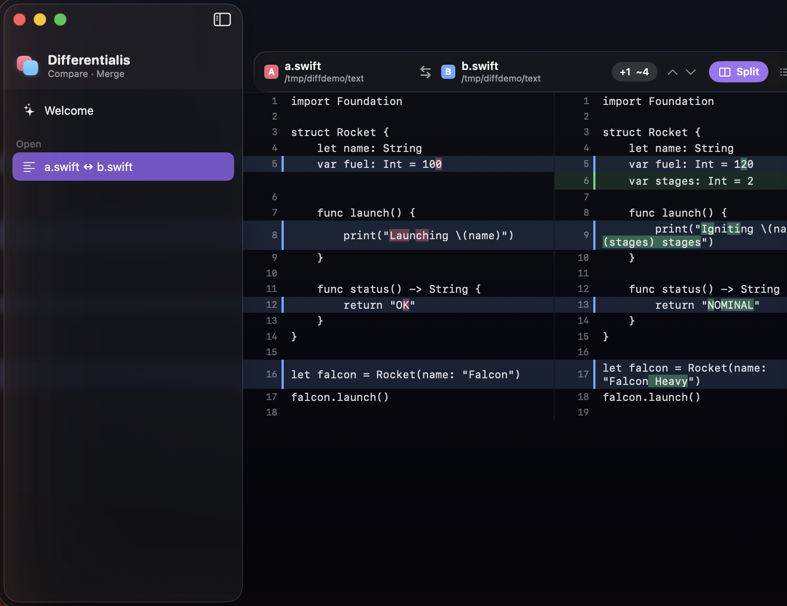

<div align="center">

# Differentialis

**A beautiful, native macOS app for comparing and merging text, images, and folders — with git built in.**

Written in SwiftUI with Apple's Liquid Glass. Zero third-party dependencies.




</div>

## Features

- **Text diff** — a from-scratch Myers diff engine with **character-level** intra-line highlights, **side-by-side and unified** layouts, change bars, collapsible unchanged regions, next/previous-change navigation, and live insertion/deletion stats.
- **Image diff** — four comparison modes with `⌘1`–`⌘4`:
  - **Two-Up** (side-by-side, horizontal or vertical)
  - **One-Up** (A/B with auto-blink)
  - **Split** (draggable slider reveal)
  - **Difference** (false-color — only the changed pixels glow)
  - …with synced zoom/pan and a pixel-dimension readout.
- **Folder diff** — recursive scan classifying every file as **Added / Removed / Modified / Identical**, a changes-only filter, and click-through to the right diff for each file.
- **3-way merge** — base / left / right with an editable result, per-hunk **take left / right / both / base**, conflict detection, and save-merged output.
- **Git integration** — open any repository to browse its **commit history**, inspect a commit's changeset, and diff individual files (using the system `git` — no libgit2).
- **Custom Comparison** — a Liquid Glass popover to compare **any** _Reference_ or _Commit_ against the **Working Copy**, another _Reference_, or _Commit_ — with swap, and **Save** to revisit named comparisons later.
- **Liquid Glass throughout** — glass toolbars, mode switchers, popovers, and panels native to macOS 26 Tahoe.

## Requirements

- **macOS 26 (Tahoe)** or later — the app uses the Liquid Glass APIs.
- **Xcode 26** / Swift 6.
- [XcodeGen](https://github.com/yonaskolb/XcodeGen) to generate the project: `brew install xcodegen`.

## Build & run

```bash
# 1. Generate the Xcode project from project.yml
xcodegen generate

# 2a. Open in Xcode and hit Run
open Differentialis.xcodeproj

# 2b. …or build & launch from the command line
xcodebuild -project Differentialis.xcodeproj -scheme Differentialis \
    -configuration Debug -derivedDataPath build build
open build/Build/Products/Debug/Differentialis.app
```

You can also launch straight into a comparison by passing paths:

```bash
open Differentialis.app --args fileA.txt fileB.txt      # text or image diff
open Differentialis.app --args folderA folderB          # folder diff
open Differentialis.app --args base.txt mine.txt theirs.txt   # 3-way merge
open Differentialis.app --args /path/to/git/repo        # repository browser
```

## Architecture

```
Differentialis/
├── Diff/        Myers diff (generic), line diff, char highlights, diff3 merge — pure Swift, unit-tested
├── Git/         system-`git` wrapper (Process): log, diff, blobs, refs, changesets
├── Models/      Comparison + ComparisonSource (file / git blob / working copy), saved-comparison store
├── Features/    Text · Image · Folder · Merge · Repo views
└── DesignSystem/ Liquid Glass components, theme, the app mark
```

The diff and merge engines have **no dependencies** — `MyersDiff` powers both line- and character-level diffs, and a diff3 algorithm drives the 3-way merge. Git is driven through the system `git` binary, so there is nothing to vendor.

## Tests

```bash
xcodebuild -project Differentialis.xcodeproj -scheme Differentialis test
```

Covers the Myers algorithm, line diff (including intra-line highlights), and three-way merge (clean merges, conflict detection, and identical-edit deduplication).

## Roadmap

- A `diff`-style command-line companion and a URL scheme
- Git mergetool / difftool auto-configuration
- PDF export of comparisons

## License

[MIT](LICENSE) © Jenny Plunkett
